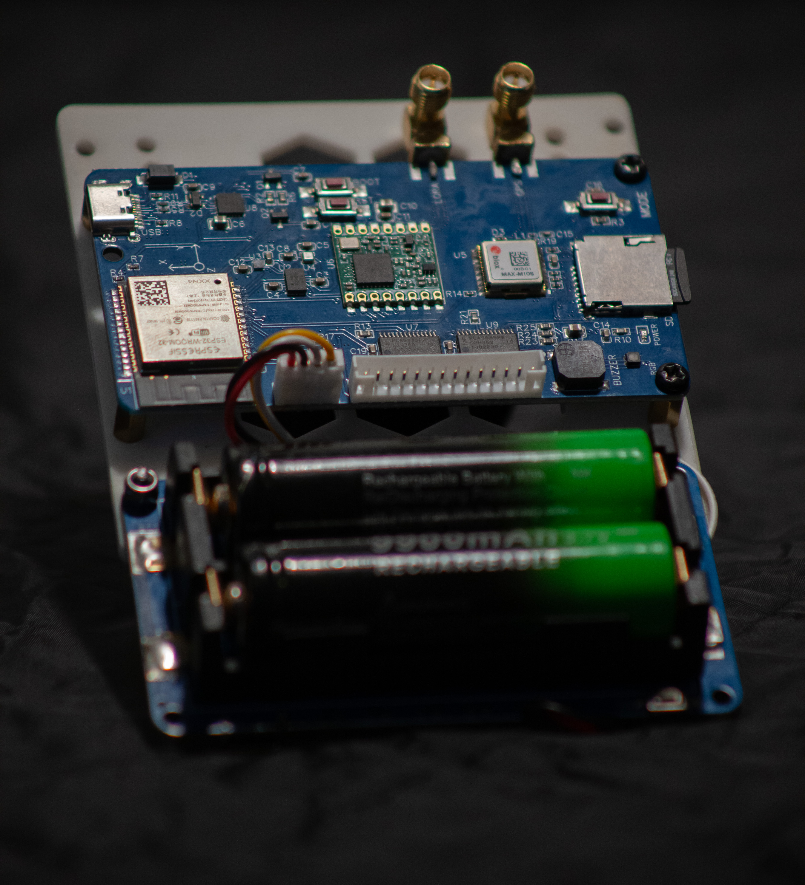
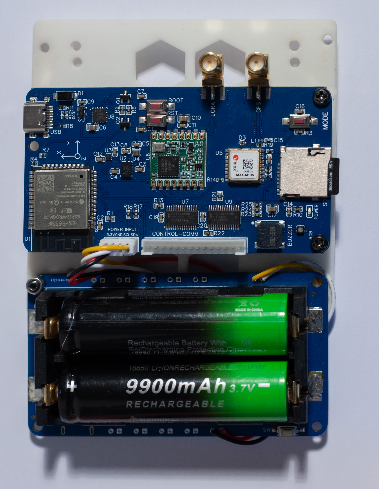
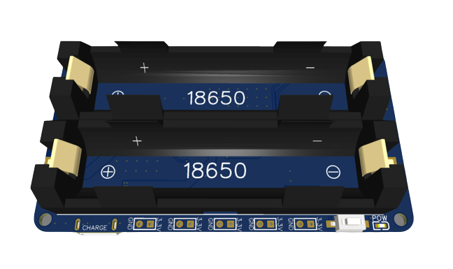
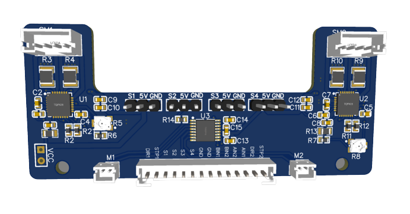

                                                                         
 <h1 align="center"></h1>                                                                          <h2 align="center">DIY Hobby - Flight Computers -Power Modules - Control Modules </h2>

Teensy 4.1 Flight Computer -> main.ino and main_simple.ino - Weather Balloon Flight Computer - 

The current CODE example contains: 

- Teensy 4.1 - MCU 
- LoRa RFM95W - Telemetry
- uBlox M10Q - GPS 
- BMP085 - Barometer
- MPU6050 - Accelerometer / Gyroscope
- HMC5883L - Magnetometer / Compass

15/11/2023 - We Are Updating the Test Codes for each component like GPS, Gyroscope, LoRa etc... Soon to update the Main CODE.

**RevoTOR PilotR1 Flight Computer** 

- 3.3v power input
- USB C programmer
- ESP32 WROOM-32 MCU
- BOSCH IMU - BMI088
- BOSCH BMM 150 Magnetometer 
- BOSCH BMP581 Pressure sensor 
- uBlox MAX-m10s-00B GPS 
- LoRa RFM95W 
- microSD Card Slot
- RGB Status LED 
- Mode Push Button  
 

For more info visit our Discord Server at: https://discord.gg/HCXPvBpP

**RevoTOR Power Module** 

- x5 - 3.3V power supply
- x5 - 5v power supply 
- x2 18650 batteries
- I2C communication with MCU 
 

For more info visit our Discord Server at: https://discord.gg/HCXPvBpP

**RevoTOR Control Module** 

- x4 Servo'
- x2 DC Motor's 
- x2 Stepper Motor's
 

For more info visit our Discord Server at: https://discord.gg/HCXPvBpP
